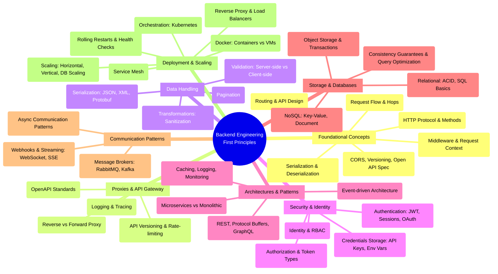

# Backend Engineering from First Principles

This repository provides a **language-agnostic** understanding of backend engineering fundamentals. Rather than focusing on specific frameworks or programming languages, this approach emphasizes the underlying systems and concepts that every backend engineer should master.

## Credits

This content is based on the excellent **"Backend Engineering from First Principles"** series by **Hussein Nasser (Sriniously)** on YouTube:
[Backend Engineering Playlist](https://www.youtube.com/playlist?list=PLui3EUkuMTPgZcV0QhQrOcwMPcBCcd_Q1)

## Overview

By understanding these foundational concepts, you can build systems that are **reliable, scalable, fault-tolerant, and maintainable**, regardless of the specific programming language or framework you use. This approach helps avoid "blind spots" that come from focusing solely on one technology stack.

## Backend Engineering Mind Map

## Table of Contents

### 1. [Foundational Concepts](./foundational-concepts/)
Understanding request flow, HTTP protocol, serialization, routing, CORS, and middleware - the building blocks of backend systems.

### 2. Proxies & API Gateway
Forward and reverse proxies, API gateways, rate limiting, and request routing.

### 3. Data Handling
Serialization formats, validation strategies, data transformation, and pagination techniques.

### 4. Security & Identity
Authentication mechanisms, authorization patterns, identity management, and credential storage.

### 5. Architectures & Patterns
Monolithic vs microservices, REST vs GraphQL, event-driven architecture, and observability.

### 6. Storage & Databases
Relational and NoSQL databases, ACID properties, consistency models, and query optimization.

### 7. Communication Patterns
Asynchronous communication, message brokers, pub/sub patterns, webhooks, and real-time streaming.

### 8. Deployment & Scaling
Containerization, orchestration, service mesh, load balancing, and horizontal/vertical scaling strategies.

---

## Why Learn from First Principles?

- **Language Agnostic**: These concepts apply regardless of whether you use Python, Java, Node.js, Go, or any other language
- **Framework Independent**: Understand what's happening under the hood of Express, Django, Spring Boot, etc.
- **Career Longevity**: Fundamentals don't change as rapidly as frameworks and tools
- **Better Problem Solving**: Debug and architect solutions at any layer of the stack
- **Informed Decisions**: Choose the right tools and patterns for your specific use case

## Getting Started

Start with **[Foundational Concepts](./foundational-concepts/)** to build your understanding from the ground up. Each section includes detailed explanations, ASCII diagrams, and practical examples.
